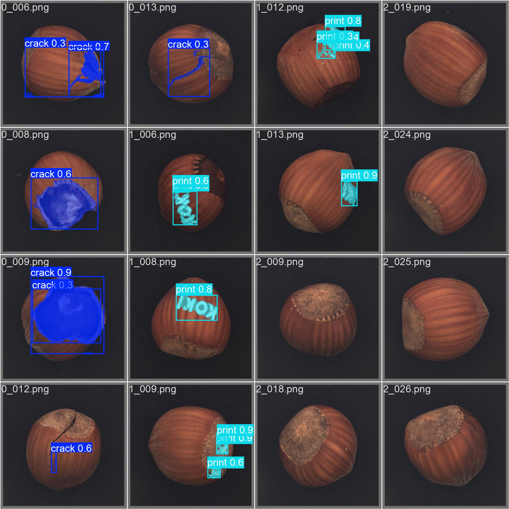

framework:
```
sudo ./commands.sh create 39 ~/Documents/projects/personal/YOLO
```

problem:
ImportError: libGL.so.1: cannot open shared object file: No such file or directory
solution:
sudo apt-get install libglu1
sudo apt-get update && apt-get install ffmpeg libsm6 libxext6  -y


# MVTec_YOLO
Run yolo models on the MVTec dataset

MVTec dataset: https://www.mvtec.com/company/research/datasets/mvtec-ad

YOLO: https://github.com/ultralytics/ultralytics

YOLO segmentation docs: https://docs.ultralytics.com/datasets/segment/#dataset-yaml-format

## Results


